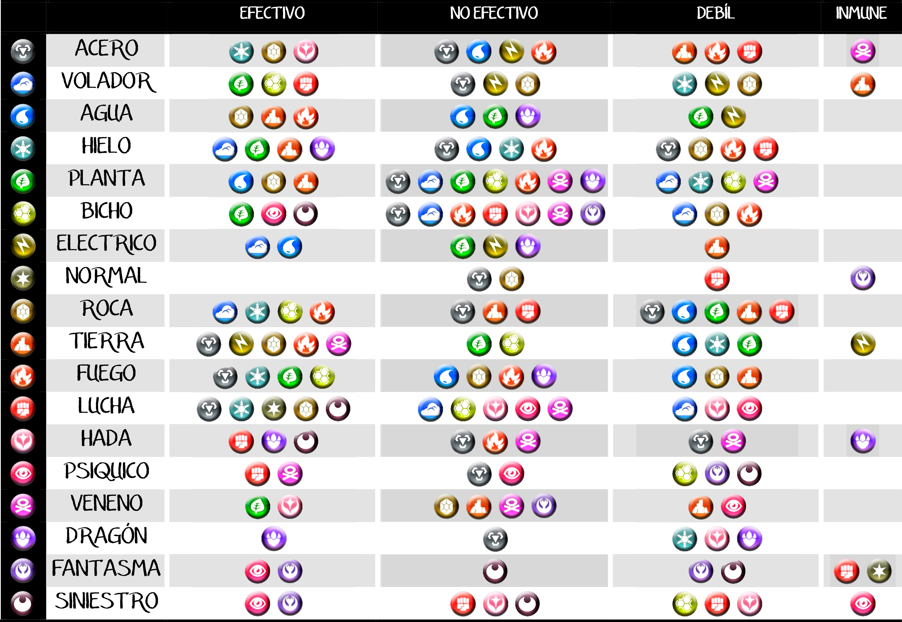

# Sintaxis de Markdown
Este es un documento que recogera la sintaxis básica de Markdown.
- Encabezados
- Listas ordenadas y desordenadas
- Inserción de código
- Enlaces
- Imágenes
- Lineas Horizontales
- Tablas
- Comentarios
## Negritas y cursivas
Esto es una **negrita**
Esto es una *cursiva*
## Listas ordenadas
1. Primero
2. Segundo
## Inserción de código fuente
````php
function ver(){
  return true
}
````
## Enlaces
[Ir a la página 2](https://www.google.com/search?q=tabla+de+tipos+pokemon&rlz=1C1CHBD_esES1065ES1065&oq=tabla+de+tipos+po&gs_lcrp=EgZjaHJvbWUqCggAEAAYsQMYgAQyCggAEAAYsQMYgAQyBggBEEUYOTIHCAIQABiABDIHCAMQABiABDIHCAQQABiABDIHCAUQABiABDIHCAYQABiABDIHCAcQABiABDIHCAgQABiABDIHCAkQABiABKgCALACAA&sourceid=chrome&ie=UTF-8#vhid=UykACFD__2b9uM&vssid=l)
## Imagenes

## Citas
Se hacen con el signo mayor
> Esto es una cita
## Tablas
|Nombre|Sentimiento|Cantidad|
|--|--|--|
|Abdel|Generosidad|1000|
|Andrés|Humor|-1000|